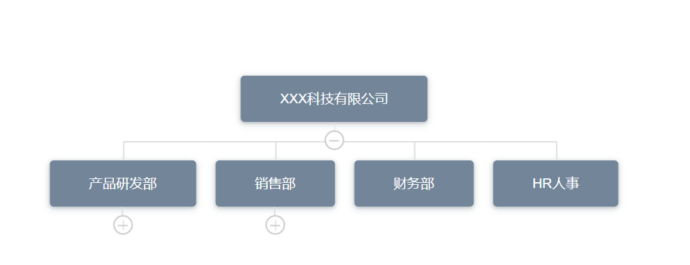

# 你不知道的 JavaScript 系列

## 跨组件通信 dispatch 和 broadcast

```JavaScript
  // src/mixins/emitter.js

  function broadcast(componentName, eventName, params) {
    this.$children.forEach(child => {
      const name = child.$options.name;

      if(name === componentName) {
        child.$emit.apply(child, [eventName].concat(params));
      } else {
        broadcast.apply(child, [componentName, eventName].concat([params]));
      }
    })
  }

  export default {
    methods: {
      dispatch(componentName, eventName, params) {
        let parent = this.$parent || this.$root;
        let name = parent.$options.name;

        while(parent && (!name || name !== componentName)) {
          parent = parent.$parent;

          if(parent) {
            name = parent.$options.name;
          }
        }

        if(parent) {
          parent.$emit.apply(parent, [eventName].concat(params));
        }
      },

      broadcast(componentName, eventName, params) {
        broadcast.call(this, componentName, eventName, params);
      }
    }
  }
```

## 树形控件 v-org-tree

  文档地址:[v-org-tree](https://github.com/lison16/v-org-tree)

  